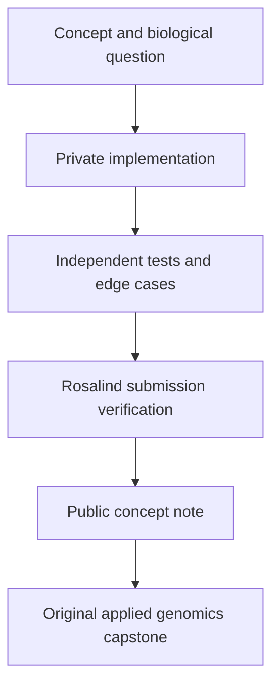

# Rosalind Bioinformatics Learning Atlas

> A rigorous, research-oriented guide to the computational ideas behind bioinformatics, built alongside a private Rosalind mastery curriculum.

This public repository is the **learning and applied-analysis companion** to my private Rosalind work. It maps the concepts, reusable methods, validation standards, and biological applications needed to progress from introductory sequence problems to real computational genomics.

It intentionally does **not** publish Rosalind challenge solutions or private challenge datasets. Rosalind asks learners not to publish solutions outside its platform; this project respects that guidance while documenting the learning architecture and original applied work. See the [Rosalind FAQ](https://rosalind.info/faq/).

## Why this exists

Solving exercises is valuable, but a strong bioinformatician also needs to understand *why* an algorithm works, when it fails, how it scales, and how it connects to real biological data.

This atlas turns that progression into a durable research portfolio:

- a structured map of the full official Rosalind curriculum
- concise, biology-first explanations of major algorithm families
- reusable, independently tested methods developed in a private learning workspace
- original applied capstones in sequence analysis, assembly, alignment, phylogeny, and microbial pangenomics
- transparent standards for validation, reproducibility, and scientific interpretation

## Curriculum at a glance

Rosalind currently organizes its learning material into five complementary tracks.

| Track | Current scope | What it develops |
|---|---:|---|
| Python Village | 6 exercises | Python foundations for computational biology |
| Bioinformatics Stronghold | 105 exercises | Core algorithms: sequences, probability, graphs, alignment, assembly, phylogeny, mass spectrometry |
| Bioinformatics Armory | 15 exercises | Practical use of established bioinformatics software and data services |
| Textbook Track | 124 exercises | Algorithmic depth across motifs, graphs, dynamic programming, strings, clustering, and HMMs |
| Algorithmic Heights | 34 exercises | General algorithmic tools that underpin scalable bioinformatics |

The current official catalogue contains 284 exercises in total. Track definitions and the live catalogue are maintained by [Rosalind](https://rosalind.info/problems/locations/).

## The learning model

A task is only considered *verified* in the private curriculum after it has a documented method, passes independent tests, and is accepted by Rosalind. The public atlas reports progress by topic, never by exposing challenge answers.

## Explore

| Start here | Purpose |
|---|---|
| [Learning map](docs/learning-map.md) | See the major bioinformatics domains and how they connect |
| [Build roadmap](docs/roadmap.md) | Follow the staged path from foundations to pangenomics |
| [Verification standards](docs/repository-governance.md) | Understand what “complete” and “tested” mean here |
| [Applied capstones](capstones/README.md) | See how algorithmic ideas become research-ready analyses |
| [Legacy materials](legacy/README.md) | Context for the original notebooks that began this project |

## Scope and integrity

This is not a claim that completing Rosalind makes anyone perfect at all bioinformatics analysis. It is a demanding foundation. Real-world competence also requires experimental design, data quality control, statistical reasoning, reproducible computing, tool evaluation, and biological interpretation. Those are the skills this atlas will connect to my work in microbial evolutionary genomics and pangenomics.

## About

Maintained by [Muhammad Bilal](https://mbilal-ou.github.io/), doctoral researcher in microbial evolutionary genomics at Oakland University.

For the project’s intended standards and contribution approach, see [CONTRIBUTING.md](CONTRIBUTING.md).
